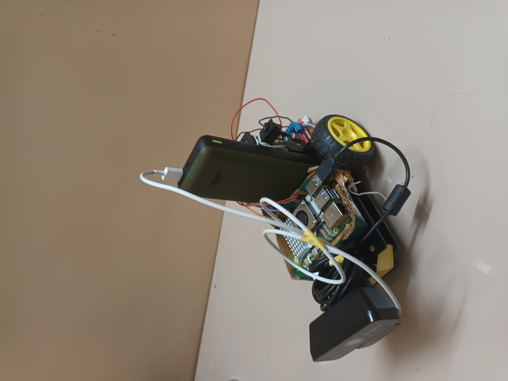
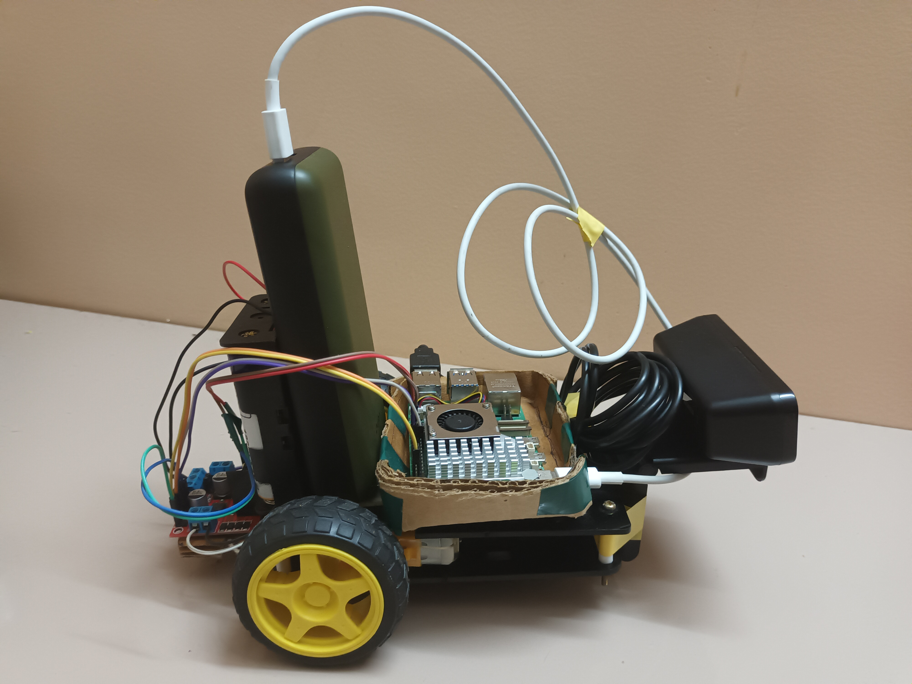

# Smart buddy

An AI-powered robot capable of human-following, obstacle avoidance, and manual control. This project utilizes a Raspberry Pi, a PiCamera, and a motor driver to create an intelligent and interactive robotic platform. The robot can detect and follow people, navigate around obstacles, and be controlled remotely.

-----

## 🖼️ Gallery

<table align="center">
  <tr>
    <td align="center">
      
    </td>
    <td align="center">
      
    </td>
  </tr>
</table>

-----

## ✨ Features

  * **Human Following**: Utilizes a machine learning model (MobileNet SSD) to detect and follow people. The robot adjusts its movement to keep the person centered in its view.
  * **Obstacle Avoidance**: Can detect and avoid obstacles in its path. The robot will stop, reverse, and turn to navigate around objects like chairs, bottles, and people.
  * **Manual Control**: A script is provided for manual control of the robot's movements, including forward, backward, left, and right turns, as well as speed adjustments.
  * **Performance Logging**: The human-following script includes functionality to log performance metrics such as latency and FPS to a CSV file for analysis.
  * **Video Streaming**: Streams the robot's camera feed over the network using Flask, allowing for real-time monitoring of its surroundings.
  * **LED Indicators**: Uses LEDs to indicate the robot's status, such as when it's tracking an object, turning, or has stopped.

-----

## 🛠️ Hardware Requirements

  * Raspberry Pi (3B+ or newer recommended)
  * PiCamera
  * Motor Driver (L298N or similar)
  * DC Motors
  * Wheels and Robot Chassis
  * LEDs
  * Power Supply (Power bank or batteries)
  * (Optional) Google Coral USB Accelerator for enhanced performance.

-----

## 🔧 Software Requirements

  * Python 3
  * OpenCV
  * TensorFlow Lite
  * gpiozero
  * Flask
  * NumPy
  * Pillow
  * psutil

-----

## ⚙️ Installation

1.  **Clone the repository:**

    ```bash
    git clone https://github.com/your_username/ai-robot.git
    cd ai-robot
    ```

2.  **Install the required Python libraries:**

    ```bash
    pip install -r requirements.txt
    ```

    *(Note: You will need to create a `requirements.txt` file listing all the necessary libraries.)*

3.  **Download the pre-trained model:**
    The project uses the `mobilenet_ssd_v2_coco_quant_postprocess.tflite` model and `coco_labels.txt`. Make sure these files are present in the `model` directory as referenced in the scripts.

-----

## 🚀 Usage

The project is divided into several Python scripts, each serving a specific purpose.

### 🤖 Human Following

This mode allows the robot to detect and follow a person.

  * **To run with video streaming:**

    ```bash
    python human_follower.py
    ```

    Open a web browser and navigate to `http://<your_pi_ip_address>:2204` to view the video feed.

  * **To run with performance logging (headless):**

    ```bash
    python human_follower_with_log.py
    ```

    This will save performance data to `latency_log.csv`.

### 🚧 Obstacle Avoidance

In this mode, the robot will move forward and autonomously avoid any detected obstacles.

  * **To run:**
    ```bash
    python obstacle_avoider.py
    ```
    Access the video feed at `http://<your_pi_ip_address>:2205`.

### 🕹️ Manual Control

This script allows you to control the robot's movements manually using the keyboard.

  * **To run:**
    ```bash
    python motor_check.py
    ```
      - `W`: Forward
      - `S`: Backward
      - `A`: Left
      - `D`: Right
      - `1-4`: Set speed (25%, 50%, 75%, 100%)
      - `Q`: Quit

### 💡 LED Testing

A simple script to test the functionality of the connected LEDs.

  * **To run:**
    ```bash
    python test_led.py
    ```

-----

## 🧠 How It Works

### Human Following Logic

The `human_follower.py` script captures video from the PiCamera and uses a TensorFlow Lite model to detect objects. When a 'person' is detected, the script calculates the person's center coordinates. The robot then adjusts its motors to keep these coordinates in the center of the frame. The distance to the person is estimated based on the size of the bounding box, and the robot moves to maintain a certain distance.

### Obstacle Avoidance Logic

The `obstacle_avoider.py` script also uses object detection. It identifies a predefined list of objects to avoid. When one of these objects is detected within a certain proximity and in the center of the robot's path, it triggers an avoidance maneuver. This involves stopping, reversing for a short duration, and then turning left or right to navigate around the obstacle.

-----


## 🤝 Contributing

Contributions are welcome\! Please feel free to submit a pull request or open an issue for any bugs, features, or suggestions.
